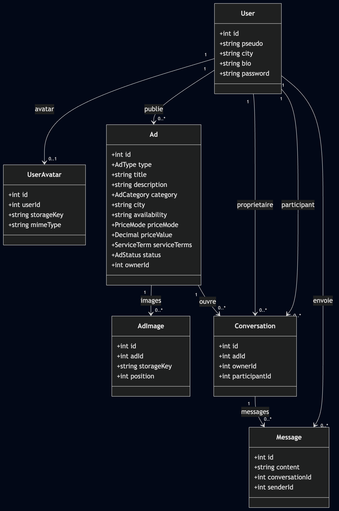

# Greglist

Greglist est une petite application web de petites annonces de services, dans l'esprit d'un Craigslist local. Un utilisateur peut proposer un service ou chercher un service, et la mise en relation se fait via une messagerie interne liée à l'annonce. Pas de paiement en ligne.


**Démo en ligne : https://greglist.hugolm.com**

## Stack

- **Back-end** : Node.js + Express, Prisma, PostgreSQL
- **Front-end** : Svelte + Vite
- **Infra de dev** : Docker Compose (PostgreSQL + back + front)

## Prérequis

- Docker

## Lancer le projet

### 1. Configurer les variables d'environnement

Les  `.env` ne sont pas versionnés, on copie les modèles fournis :

```bash
cp .env.example .env
cp API/.env.example API/.env
```


### 2. Tout lancer avec Docker (recommandé)

```bash
docker compose up
```

Cette commande démarre PostgreSQL, applique les migrations, crée les données de démo (seed) et lance le back et le front. Une fois les conteneurs prêts :

- Front : http://127.0.0.1:4173
- API : http://127.0.0.1:3000


## Comptes de test

Ces comptes sont créés par le seed ([API/prisma/seed.js](API/prisma/seed.js)) :

| Pseudo | Mot de passe | Ville |
|--------|--------------|-------|
| diane  | secret987    | Paris |
| emma   | secret654    | Lyon |
| leo    | secret321    | Bordeaux |
| nora   | secret159    | Nantes |

`diane` et `nora` ont des offres publiées, `emma` a des demandes : pratique pour tester l'envoi d'un message d'un compte vers l'annonce d'un autre.


## Structure du projet

```text
greglist/
├── API/                        # Back-end Node.js Express
│   ├── prisma/
│   │   ├── migrations/         # Migrations SQL versionnées
│   │   ├── schema.prisma       # Modèle de données 
│   │   └── seed.js             # Comptes + annonces de démo
│   └── src/
│       ├── app.js              #  routes, validation, contrôle d'accès
│       ├── middleware/         # auth.js 
│       ├── lib/                # prisma.js 
│       ├── utils/              # hash, token, sérialisation, gestion des fichiers
│       └── img/                # Images uploadées (annonces + avatars)
├── Front/                      # Front-end Svelte + Vite
│   ├── index.html
│   └── src/
│       ├── App.svelte          # Shell de l'app + résolution des vues
│       ├── main.js             
│       ├── app.css             
│       ├── pages/              # Une vue par écran (annonces, profil, inbox...)
│       └── lib/
│           ├── api.js          
│           ├── router.js       
│           ├── adOptions.js    # Listes fixes (catégories, modalités, tarifs)
│           ├── media.js        # Construction des URLs d'images
│           ├── stores/         # auth.js
│           └── components/     # Formulaires réutilisables
├── Database/
│   └── schema.sql              # Export SQL du schéma (lecture rapide)
├── docker-compose.yml          # PostgreSQL + back + front
├── .env.example                
└── README.md
```


## Base de données

Le schéma est défini avec Prisma ([API/prisma/schema.prisma](API/prisma/schema.prisma)). Diagramme de classes :




## Pages de l'application

| Page | URL | Accès |
|------|-----|-------|
| Annonces (accueil) | `/` ou `/ads` | public |
| Détail d'une annonce | `/ads/:id` | public |
| Inscription | `/register` | public |
| Connexion | `/login` | public |
| Publier une annonce | `/ads/new` | connecté |
| Modifier une annonce | `/ads/:id/edit` | auteur |
| Profil | `/profile` | connecté |
| Boîte de réception | `/inbox` | connecté |
| Conversation | `/conversations/:id` | participants |
