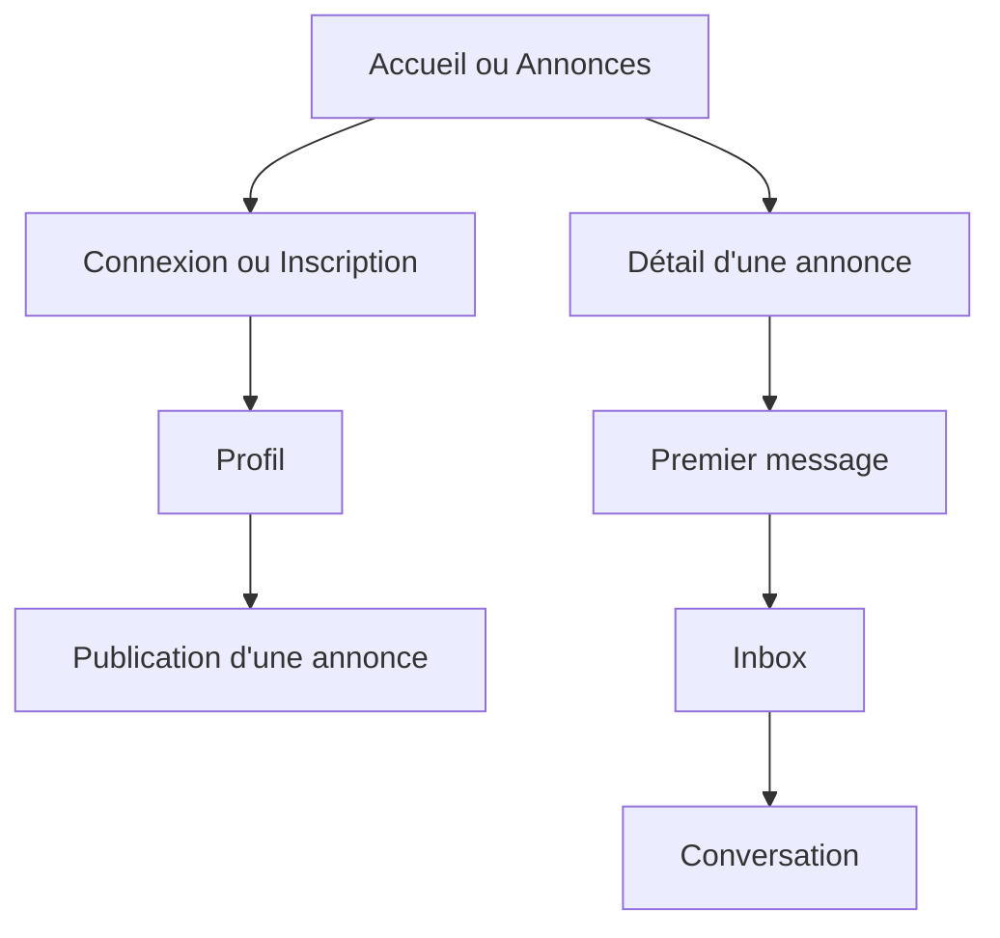
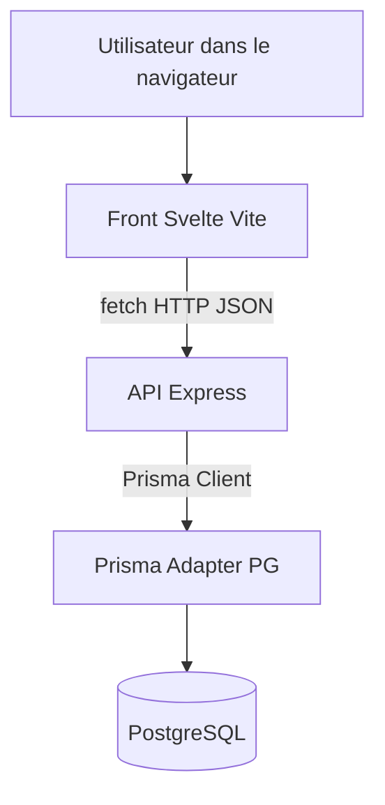
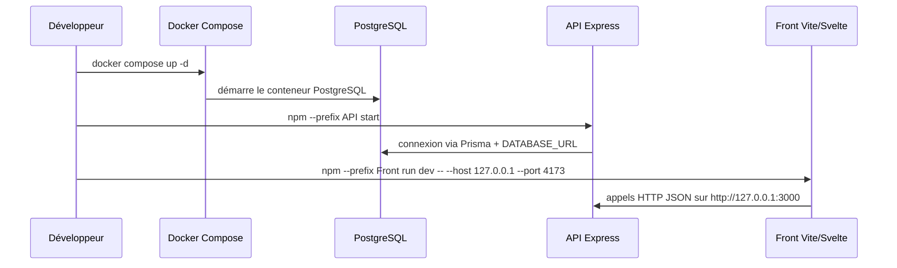
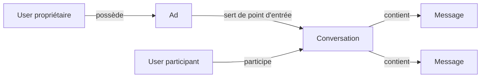
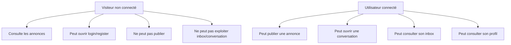
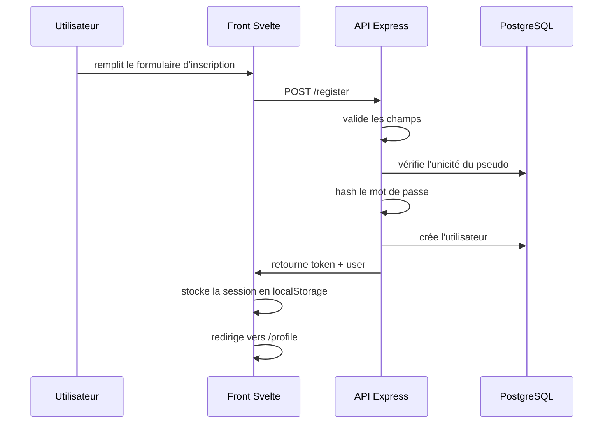
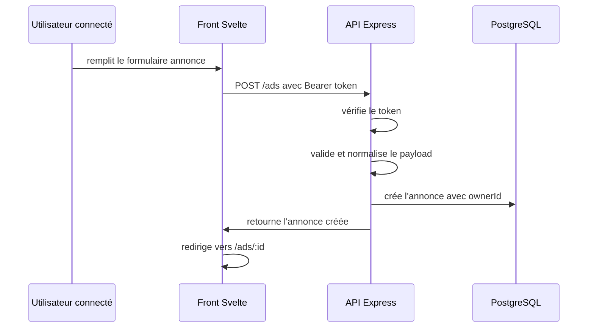
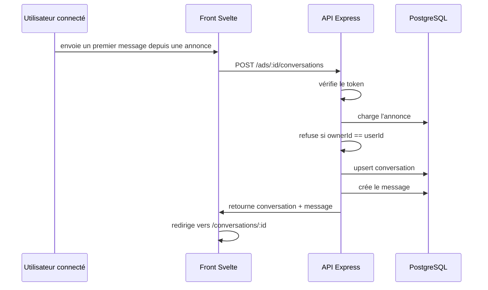

# Documentation complète de Greglist

## 0. Quick start pratique

Cette section est faite pour répondre à la question la plus concrète: comment lancer le projet, comment l'arrêter, et par où passer dans l'interface pour tester les principales fonctionnalités.

### 0.1 Prérequis rapides

Il te faut:

- Node.js 20 ou plus,
- npm,
- Docker avec un moteur actif.

### 0.2 Commandes minimales pour démarrer

Depuis la racine du projet:

#### 1. Démarrer PostgreSQL

```bash
docker compose up -d
```

#### 2. Installer les dépendances du back

```bash
npm --prefix API install
```

#### 3. Installer les dépendances du front

```bash
npm --prefix Front install
```

#### 4. Démarrer l'API

```bash
npm --prefix API start
```

L'API écoute sur:

- `http://127.0.0.1:3000`

Tu peux vérifier qu'elle répond avec:

```bash
curl http://127.0.0.1:3000/
```

Tu dois obtenir un JSON proche de:

```json
{"status":"ok"}
```

#### 5. Démarrer le front

```bash
npm --prefix Front run dev -- --host 127.0.0.1 --port 4173
```

Le front est disponible sur:

- `http://127.0.0.1:4173`

### 0.3 Comment arrêter le projet

#### Arrêter le front et l'API

Si tu les lances dans des terminaux interactifs, il suffit d'utiliser:

```bash
Ctrl+C
```

dans chaque terminal qui exécute:

- l'API,
- le front.

#### Arrêter PostgreSQL Docker

```bash
docker compose down
```

Si tu veux arrêter les conteneurs sans supprimer le réseau/les ressources du compose, tu peux aussi faire:

```bash
docker compose stop
```

### 0.4 Comment redémarrer proprement

Le cycle habituel est:

1. `docker compose up -d`
2. `npm --prefix API start`
3. `npm --prefix Front run dev -- --host 127.0.0.1 --port 4173`

En pratique, PostgreSQL peut rester lancé entre deux sessions de développement. Dans ce cas, il suffit souvent de relancer seulement l'API et le front.

### 0.5 Comptes de test

Comptes disponibles dans le projet:

- `diane / secret987`
- `emma / secret654`

### 0.6 Accès rapide aux pages

Voici les routes front utiles à connaître.

| Page | URL | Usage |
|---|---|---|
| Accueil | `http://127.0.0.1:4173/` | Point d'entrée de l'application |
| Annonces | `http://127.0.0.1:4173/ads` | Liste des annonces + filtres |
| Détail annonce | `http://127.0.0.1:4173/ads/:id` | Consultation d'une annonce précise |
| Publier | `http://127.0.0.1:4173/ads/new` | Création d'annonce |
| Inscription | `http://127.0.0.1:4173/register` | Création de compte |
| Connexion | `http://127.0.0.1:4173/login` | Connexion utilisateur |
| Profil | `http://127.0.0.1:4173/profile` | Informations du compte connecté |
| Inbox | `http://127.0.0.1:4173/inbox` | Liste des conversations |
| Conversation | `http://127.0.0.1:4173/conversations/:id` | Historique d'une conversation |

### 0.7 Pages publiques et pages protégées

#### Pages consultables sans connexion

- `/`
- `/ads`
- `/ads/:id`
- `/register`
- `/login`

#### Pages qui ont un vrai intérêt seulement une fois connecté

- `/profile`
- `/ads/new`
- `/inbox`
- `/conversations/:id`

Important: dans cette application, le front peut laisser naviguer vers certaines pages même si l'utilisateur n'est pas connecté, mais c'est ensuite la logique de la page ou l'API qui bloque l'action utile. C'est cohérent avec la philosophie du projet: la vraie sécurité est côté serveur.

### 0.8 Parcours conseillé pour découvrir l'application

Si tu veux comprendre rapidement le fonctionnement métier, fais ce parcours:

1. ouvre `/ads` pour voir les annonces existantes,
2. ouvre `/register` si tu veux créer un compte, sinon utilise un compte de test via `/login`,
3. va sur `/profile` pour vérifier que la session est bien active,
4. va sur `/ads/new` pour publier une annonce,
5. retourne sur `/ads` pour voir la liste,
6. ouvre une annonce qui n'est pas la tienne,
7. envoie un premier message,
8. va sur `/inbox`,
9. ouvre la conversation correspondante.

### 0.9 Vue d'ensemble ultra rapide des flux utilisateur



### 0.10 Si quelque chose ne marche pas

Ordre de vérification recommandé:

1. vérifier que Docker tourne,
2. vérifier que PostgreSQL est lancé avec `docker compose ps`,
3. vérifier que l'API répond sur `http://127.0.0.1:3000`,
4. vérifier que le front tourne sur `http://127.0.0.1:4173`,
5. vérifier les variables `.env` et `API/.env`.

Si le front charge mais que les actions échouent, le problème vient le plus souvent de l'API, du token d'authentification, ou de la base de données.

## 1. Objectif du projet

Greglist est une application de petites annonces locales centrée sur un cas d'usage simple:

- un utilisateur crée un compte,
- il publie une annonce de type offre ou demande,
- un autre utilisateur consulte cette annonce,
- il ouvre une conversation privée à partir de cette annonce,
- les deux participants peuvent ensuite consulter le fil de discussion.

Le projet est volontairement construit avec une architecture simple et lisible:

- une base PostgreSQL,
- un back-end Node.js avec Express,
- Prisma comme ORM,
- un front Svelte sans framework applicatif lourd,
- une authentification par JWT porté dans l'en-tête `Authorization`.

L'objectif n'est pas de maximiser le nombre d'abstractions. L'objectif est de garder un code direct, compréhensible et vérifiable rapidement.

---

## 2. Vue d'ensemble

### 2.1 Architecture générale



### 2.2 Lecture rapide

- le front ne contient quasiment pas de logique métier critique,
- le back fait les validations d'entrée,
- le back décide de l'autorisation,
- la base stocke les utilisateurs, annonces, conversations et messages,
- le JWT sert uniquement à identifier l'utilisateur appelant côté API.

Cette séparation suit une règle structurante du projet: zéro confiance au front-end.

Le navigateur peut mentir. Le serveur, lui, doit vérifier.

### 2.3 Résumé opérationnel des responsabilités

Pour éviter toute ambiguïté, on peut résumer le projet ainsi:

- le front gère l'expérience utilisateur et l'état d'interface,
- l'API gère les règles métier et la sécurité,
- Prisma sert de couche de traduction entre la logique applicative et PostgreSQL,
- PostgreSQL reste la source de vérité des données.

Dit autrement:

- ce que l'utilisateur voit est piloté par le front,
- ce que l'utilisateur a le droit de faire est décidé par le back,
- ce qui est durablement vrai est stocké en base.

---

## 3. Arborescence du projet

### 3.1 Structure principale

```text
greglist/
├── API/
│   ├── prisma/
│   │   ├── migrations/
│   │   └── schema.prisma
│   ├── src/
│   │   ├── lib/
│   │   ├── middleware/
│   │   ├── utils/
│   │   └── app.js
│   ├── .env
│   ├── package.json
│   └── prisma.config.ts
├── Database/
│   └── schema.sql
├── Front/
│   ├── src/
│   │   ├── lib/
│   │   │   ├── api.js
│   │   │   ├── router.js
│   │   │   ├── stores/
│   │   │   └── components/
│   │   ├── pages/
│   │   ├── App.svelte
│   │   ├── app.css
│   │   └── main.js
│   ├── index.html
│   ├── package.json
│   └── vite.config.js
├── docs/
│   └── ARCHITECTURE.md
├── .env
├── docker-compose.yml
├── README.md
└── prompt.md
```

### 3.2 Rôle de chaque dossier

#### `API/`

Contient tout le back-end:

- les routes HTTP,
- la logique de validation,
- la logique d'autorisation,
- la connexion à la base,
- le schéma Prisma.

#### `Front/`

Contient l'interface utilisateur:

- navigation,
- formulaires,
- appels API,
- stockage local de la session,
- rendu des annonces et des conversations.

#### `Database/`

Contient l'export SQL du schéma initial, utile pour:

- audit,
- lecture rapide du modèle relationnel,
- documentation,
- comparaison avec Prisma.

#### `docs/`

Contient la documentation détaillée du projet.

---

## 4. Démarrage du système de bout en bout

### 4.1 Séquence de démarrage



### 4.2 Pourquoi cette architecture de démarrage

Le choix ici est volontairement simple:

- PostgreSQL est isolé dans Docker pour éviter les écarts de machine locale.
- L'API et le front tournent en local pour garder un cycle de développement rapide.
- Le front parle directement à l'API en HTTP, ce qui rend les échanges visibles et faciles à déboguer.

Ce n'est pas l'architecture la plus industrialisée possible, mais c'est une architecture très adaptée à un projet de taille petite à moyenne ou à un exercice de construction full-stack complet.

### 4.3 Pourquoi il y a trois processus séparés

En développement, il faut bien distinguer trois choses:

- la base de données,
- le serveur API,
- le serveur front.

Le fait de les séparer a plusieurs avantages:

- quand l'UI a un problème, on peut rapidement voir si le back répond encore,
- quand l'API a un problème, on peut la tester avec `curl` ou Postman sans passer par le front,
- quand la base a un problème, Prisma ou Express remontent des erreurs plus localisées.

Cette séparation rend le débogage beaucoup plus clair qu'un démarrage monolithique où tout serait masqué derrière un seul processus.

---

## 5. Couche base de données

## 5.1 Choix de PostgreSQL

PostgreSQL a été choisi parce que:

- il gère naturellement les relations entre utilisateurs, annonces, conversations et messages,
- il est robuste,
- Prisma l'intègre très bien,
- il permet de faire évoluer le schéma proprement avec migrations.

Le projet n'a pas besoin ici d'une base NoSQL. Les données ont une structure relationnelle nette:

- une annonce appartient à un utilisateur,
- une conversation relie une annonce et deux utilisateurs,
- un message appartient à une conversation et à un expéditeur.

Un modèle relationnel est donc le choix le plus cohérent.

---

## 5.2 Modèle métier

### Entités principales

- `User`: identité fonctionnelle de l'utilisateur.
- `Ad`: annonce publiée par un utilisateur.
- `Conversation`: canal privé entre propriétaire de l'annonce et participant.
- `Message`: message individuel à l'intérieur d'une conversation.

### Diagramme conceptuel simplifié



---

## 5.3 Schéma Prisma détaillé

Le schéma Prisma est défini dans `API/prisma/schema.prisma`.

### `User`

Champs:

- `id`: identifiant numérique auto-incrémenté.
- `pseudo`: identifiant public logique, unique.
- `city`: ville de rattachement.
- `bio`: champ libre facultatif.
- `password`: mot de passe hashé.
- `createdAt`, `updatedAt`: timestamps de traçabilité.

Relations:

- `ads`: annonces publiées par cet utilisateur.
- `ownedConversations`: conversations où il est propriétaire de l'annonce.
- `participatingConversations`: conversations où il est l'autre partie.
- `messages`: messages envoyés par cet utilisateur.

Pourquoi ce modèle:

- `pseudo` est unique pour simplifier la connexion utilisateur.
- le mot de passe est stocké hashé, jamais en clair.
- les relations sont explicites, ce qui aide Prisma mais aussi la lisibilité métier.

### `Ad`

Champs:

- `type`: `OFFER` ou `REQUEST`.
- `title`: titre court.
- `description`: description détaillée.
- `category`: catégorie métier.
- `city`: ville associée.
- `availability`: disponibilité facultative.
- `price`: prix facultatif.
- `terms`: modalités facultatives.
- `status`: `PUBLISHED` ou `ARCHIVED`.
- `ownerId`: propriétaire.

Pourquoi ce modèle:

- `type` permet de gérer offre et demande dans une même table.
- `status` prépare une évolution métier sans devoir supprimer les annonces.
- les champs facultatifs permettent une annonce simple sans surcharger l'utilisateur.

### `Conversation`

Champs:

- `adId`: annonce source.
- `ownerId`: propriétaire de l'annonce.
- `participantId`: utilisateur qui contacte le propriétaire.

Contrainte importante:

- `@@unique([adId, ownerId, participantId])`

Pourquoi cette contrainte est importante:

- elle évite de créer plusieurs conversations parallèles identiques entre les mêmes personnes pour la même annonce,
- elle permet un `upsert` propre lors du premier message.

### `Message`

Champs:

- `content`: corps du message.
- `conversationId`: conversation cible.
- `senderId`: expéditeur.
- `createdAt`: horodatage du message.

Pourquoi un modèle séparé:

- une conversation est un conteneur,
- un message est un événement de cette conversation,
- cela permet un historique ordonné et extensible.

---

## 6. Couche back-end

## 6.1 Philosophie générale du back-end

Le back-end a été écrit avec une approche centralisée dans `API/src/app.js`.

Ce choix n'est pas le plus modulaire possible, mais il a plusieurs avantages dans ce projet:

- lecture linéaire très facile,
- moins de dispersion entre fichiers,
- comportement observable rapidement,
- coût cognitif plus faible pour un petit périmètre.

Sur un projet plus gros, on séparerait probablement:

- contrôleurs,
- services,
- validateurs,
- repositories,
- routes.

Ici, le choix a été de privilégier la clarté et la rapidité d'audit.

---

## 6.2 Initialisation de l'application Express

Dans `API/src/app.js`, le serveur démarre avec:

- `dotenv` pour charger la configuration,
- `helmet` pour durcir les en-têtes HTTP,
- `cors` pour autoriser le front local,
- `morgan` pour journaliser les requêtes,
- `express.json()` pour parser le JSON.

### Pourquoi ces middlewares

#### `dotenv`

Permet de garder les secrets et URL hors du code.

#### `helmet`

Applique plusieurs protections HTTP standards sans coût important.

#### `cors`

Nécessaire parce que le front tourne sur `127.0.0.1:4173` et l'API sur `127.0.0.1:3000`.

Sans CORS, le navigateur bloque les requêtes inter-origines même si l'API répond correctement.

#### `morgan`

Permet de voir rapidement:

- quelle route a été appelée,
- avec quel verbe,
- dans quel délai,
- avec quel code HTTP.

#### `express.json()`

Indispensable pour recevoir les payloads JSON du front.

---

## 6.3 Connexion base de données

Le client Prisma est initialisé dans `API/src/lib/prisma.js` avec `@prisma/adapter-pg`.

Pourquoi ce choix:

- Prisma 7 impose un mode d'intégration qui passe par un adaptateur PG dans ce projet,
- l'adaptateur sépare proprement la couche Prisma de la couche driver PostgreSQL,
- cela rend la configuration explicite.

Flux:

1. `process.env.DATABASE_URL` est lu.
2. `PrismaPg` construit l'adaptateur.
3. `PrismaClient` utilise cet adaptateur.
4. le même client est partagé par toutes les routes.

---

## 6.4 Authentification

### 6.4.1 Choix du JWT

Le projet utilise un JWT Bearer.

Pourquoi ce choix:

- simple à mettre en place,
- facile à envoyer depuis le front,
- bien adapté à une API JSON stateless,
- évite d'introduire une gestion de session serveur plus lourde.

Le token contient:

- `userId`
- `pseudo`

Sa durée de vie est définie à `7d`.

### 6.4.2 Hashage des mots de passe

Le hashage passe par `bcrypt` dans `API/src/utils/hash.js`.

Pourquoi `bcrypt`:

- c'est un standard largement éprouvé,
- il est conçu pour ralentir volontairement le bruteforce,
- il évite tout stockage de mot de passe brut.

### 6.4.3 Middleware d'authentification

`API/src/middleware/auth.js` lit l'en-tête:

- `Authorization: Bearer <token>`

Puis il:

1. vérifie que l'en-tête existe,
2. vérifie qu'il commence par `Bearer `,
3. extrait le token,
4. vérifie sa signature via `verifyAuthToken`,
5. stocke le résultat dans `request.auth`.

Ce point est central, car toutes les routes protégées dépendent ensuite de `request.auth.userId`.

---

## 6.5 Flux d'inscription et de connexion

### Route `POST /register`

Responsabilités:

- valider les champs d'entrée,
- vérifier l'unicité du pseudo,
- hasher le mot de passe,
- créer l'utilisateur,
- émettre un token,
- renvoyer le profil public minimal.

Pourquoi retourner immédiatement le token:

- cela évite un second appel de connexion juste après l'inscription,
- le front peut se connecter directement après création du compte.

### Route `POST /login`

Responsabilités:

- valider le format du payload,
- retrouver l'utilisateur par pseudo,
- comparer le mot de passe avec `bcrypt.compare`,
- générer un JWT,
- renvoyer le token et le profil public.

Pourquoi le login par pseudo:

- cohérent avec le modèle `pseudo` unique,
- simple côté UX,
- simple côté code.

### Route `POST /logout`

Dans cette version, la route renvoie seulement `204`.

Pourquoi ce comportement minimaliste:

- le JWT est stateless,
- le vrai logout consiste surtout à supprimer le token côté client,
- l'endpoint existe pour garder un contrat API clair et cohérent.

---

## 6.6 Gestion des annonces

### 6.6.1 Création d'annonce: `POST /ads`

Le back passe par `buildAdCreateInput(payload)`.

Cette fonction est importante parce qu'elle centralise:

- validation du type,
- longueurs minimales,
- typage des champs facultatifs,
- normalisation des chaînes,
- gestion du prix,
- valeur par défaut du statut.

Pourquoi ce choix:

- éviter la duplication de validation dans la route,
- garder une seule source de vérité pour les contraintes de création.

### 6.6.2 Lecture d'une annonce: `GET /ads/:id`

Comportement:

- parse l'identifiant,
- vérifie qu'il est valide,
- cherche l'annonce,
- renvoie `404` si absente.

### 6.6.3 Mise à jour d'une annonce: `PUT /ads/:id`

Étapes:

1. vérifier l'identifiant,
2. charger le propriétaire,
3. comparer avec `request.auth.userId`,
4. rejeter si l'utilisateur n'est pas propriétaire,
5. appliquer `buildAdUpdateInput(payload)`,
6. faire l'update Prisma.

Pourquoi cette séparation validation + autorisation:

- la validation répond à la question "les données sont-elles valides ?",
- l'autorisation répond à la question "cet utilisateur a-t-il le droit ?".

Ces deux préoccupations doivent rester distinctes.

### 6.6.4 Suppression d'une annonce: `DELETE /ads/:id`

Même logique que pour la modification:

- validation de l'ID,
- lecture de l'annonce,
- contrôle de propriété,
- suppression.

Ce contrôle est indispensable pour respecter le cloisonnement métier.

---

## 6.7 Listing, recherche, filtres et tri

La route `GET /ads` concentre toute la logique de consultation publique.

### Règles appliquées

- seules les annonces `PUBLISHED` sont retournées,
- recherche texte sur `title` et `description`,
- filtre par `type`,
- filtre exact insensible à la casse sur `category`,
- filtre exact insensible à la casse sur `city`,
- tri `newest`, `price_asc`, `price_desc`.

### Pourquoi ce design

- garder un endpoint unique pour la liste simplifie le front,
- les filtres URL sont faciles à inspecter et à reproduire,
- Prisma permet de générer la requête SQL dynamiquement sans complexité excessive.

### Remarque importante sur le tri par prix

Le projet garde le prix facultatif. Cela signifie que certaines lignes peuvent avoir `NULL`.

Le choix ici est d'accepter cette souplesse métier au lieu d'imposer un prix partout.

---

## 6.8 Messagerie

### 6.8.1 Premier message depuis une annonce

Route: `POST /ads/:id/conversations`

Logique:

1. valider `adId`,
2. valider `content`,
3. charger l'annonce,
4. interdire de contacter sa propre annonce,
5. créer ou réutiliser la conversation via `upsert`,
6. créer le premier message,
7. renvoyer conversation + message.

Pourquoi `upsert` ici:

- évite les doublons de conversation,
- garantit un comportement stable si un utilisateur relance un contact,
- s'appuie proprement sur la contrainte d'unicité Prisma.

### 6.8.2 Inbox: `GET /conversations`

Logique:

- retourne les conversations où l'utilisateur est `owner` ou `participant`,
- inclut l'annonce liée,
- inclut le dernier message uniquement,
- trie par `updatedAt` décroissant.

Pourquoi inclure seulement le dernier message:

- pour une boîte de réception, on veut un aperçu,
- cela évite de charger tout l'historique inutilement.

### 6.8.3 Historique d'une conversation: `GET /conversations/:id/messages`

Logique:

- vérifie que la conversation existe,
- vérifie que l'utilisateur fait partie des participants,
- retourne les messages ordonnés chronologiquement.

Pourquoi ce contrôle est critique:

- une conversation contient des données privées,
- connaître un identifiant numérique ne doit jamais suffire à lire le contenu.

---

## 6.9 Gestion des erreurs

Le back termine avec deux middlewares:

- un middleware 404 pour les routes inconnues,
- un middleware global d'erreur JSON.

### Pourquoi ce choix

Sans cela, Express peut renvoyer des réponses peu cohérentes avec l'API JSON attendue par le front.

Ici, le contrat devient clair:

- chaque erreur renvoie un JSON de la forme `{ error: "message" }`.

Cela simplifie énormément le front, qui peut afficher `error.message` sans deviner le format de retour.

---

## 7. Couche front-end

## 7.1 Philosophie générale du front

Le front a été construit sans routeur tiers ni état global complexe.

Pourquoi:

- le périmètre est restreint,
- Svelte permet déjà un code très direct,
- un routeur maison minimal est suffisant,
- cela réduit les dépendances et la magie implicite.

En pratique, le front repose sur quatre briques:

- `App.svelte` pour l'orchestration,
- `router.js` pour la navigation,
- `auth.js` pour la session,
- `api.js` pour les appels réseau.

---

## 7.2 Bootstrap du front

Dans `Front/src/main.js`:

1. les styles globaux sont chargés,
2. le store d'auth est hydraté depuis `localStorage`,
3. `App.svelte` est monté dans `#app`.

Pourquoi hydrater avant le montage:

- cela évite un clignotement où l'application croirait l'utilisateur déconnecté juste avant de relire la session.

---

## 7.3 Routeur maison

Le routeur est implémenté dans `Front/src/lib/router.js`.

### Fonctionnement

- `route` est un store lisant `window.location.pathname`,
- `navigate(path)` pousse un nouvel état avec `history.pushState`,
- un `PopStateEvent` est déclenché pour notifier l'application.

### Pourquoi ce choix

Pour ce projet, le routeur a besoin seulement de:

- lire l'URL courante,
- changer de page,
- réagir au bouton précédent du navigateur.

Un routeur externe aurait ajouté plus de poids conceptuel que de valeur.

### Limites assumées

- pas de route params déclaratifs,
- pas de garde de navigation abstraite,
- pas de nested routes.

Ces limites sont acceptables ici, car le nombre d'écrans est faible.

---

## 7.4 Résolution des vues dans `App.svelte`

`App.svelte` joue le rôle de shell applicatif.

Responsabilités:

- afficher la barre de navigation,
- résoudre la vue en fonction du pathname,
- injecter les props nécessaires (`adId`, `conversationId`),
- afficher le bouton de logout si l'utilisateur est connecté.

### Pourquoi centraliser la résolution ici

- toutes les routes sont visibles dans un seul fichier,
- la navigation reste facile à auditer,
- la logique de composition de page est explicite.

---

## 7.5 Store d'authentification

Le store dans `Front/src/lib/stores/auth.js` gère:

- `token`,
- `user`,
- `ready`.

### Méthodes principales

- `hydrate()`: relit la session depuis `localStorage`,
- `setSession(session)`: stocke la session,
- `patchUser(user)`: met à jour l'utilisateur,
- `clearSession()`: supprime la session.

### Pourquoi utiliser `localStorage`

- simple,
- adapté à un front SPA local,
- cohérent avec le choix JWT stateless.

### Point de vigilance

`localStorage` n'est pas la solution la plus robuste face aux risques XSS dans un produit exposé publiquement. Ici, le choix est pédagogique et pragmatique pour une application simple.

Sur une version plus durecie, on envisagerait des cookies `HttpOnly` avec une stratégie CSRF adaptée.

### 7.5.1 Cycle de vie de la session côté front

Le cycle de session fonctionne comme ceci:

1. au chargement de l'application, `hydrate()` relit `localStorage`,
2. si une session existe, elle est injectée dans le store,
3. les pages et le header réagissent automatiquement à cet état,
4. lors d'une connexion ou inscription réussie, `setSession()` remplace la session courante,
5. lors d'une déconnexion, `clearSession()` vide l'état et `localStorage`.

Ce point est important pour comprendre pourquoi, après un refresh navigateur, l'utilisateur reste connecté sans avoir à se reconnecter immédiatement.

---

## 7.6 Couche API du front

Le fichier `Front/src/lib/api.js` est le point unique des appels réseau.

### Rôle de `request()`

Cette fonction commune:

- construit l'URL,
- ajoute les headers nécessaires,
- sérialise le body JSON,
- gère le cas `204 No Content`,
- lit la réponse JSON,
- convertit les erreurs API en exceptions JavaScript.

Pourquoi ce choix:

- éviter de dupliquer `fetch` partout,
- garder un format d'erreur homogène,
- séparer les vues de la plomberie HTTP.

### Services exposés

- `registerUser`
- `loginUser`
- `logoutUser`
- `getAds`
- `getAd`
- `createAd`
- `startConversation`
- `getConversations`
- `getConversationMessages`

Chaque fonction a une responsabilité simple et son nom décrit le contrat métier.

---

## 7.7 Pages front détaillées

Avant d'entrer dans les pages une par une, il faut garder en tête une règle simple:

- les pages publiques servent surtout à consulter,
- les pages liées à l'identité ou à l'écriture dépendent d'une session active,
- même quand le front affiche une page, l'API reste le dernier arbitre sur ce qui est permis.

## 7.7.1 Inscription

Le formulaire d'inscription collecte:

- pseudo,
- ville,
- bio,
- mot de passe.

Flux:

1. l'utilisateur soumet,
2. la page appelle `registerUser`,
3. si succès, la session est stockée,
4. l'utilisateur est redirigé vers `/profile`.

Pourquoi cette redirection:

- elle confirme immédiatement que la session est active,
- elle montre à l'utilisateur le résultat concret de l'inscription.

Ce choix réduit aussi la friction: l'utilisateur ne crée pas un compte pour être renvoyé vers un écran neutre, il voit tout de suite que l'opération a produit un état connecté.

## 7.7.2 Connexion

Même logique que l'inscription:

1. soumission du formulaire,
2. appel `loginUser`,
3. stockage local de la session,
4. redirection vers le profil.

Le profil est utilisé ici comme page d'atterrissage fonctionnelle, parce qu'il représente l'état le plus clair après authentification réussie.

## 7.7.3 Profil

La page profil affiche:

- pseudo,
- ville,
- bio,
- actions de session.

Son intérêt principal est double:

- vérifier que l'authentification fonctionne,
- fournir un point d'ancrage utilisateur une fois connecté.

## 7.7.4 Liste des annonces

La page annonces gère:

- texte de recherche,
- type,
- catégorie,
- ville,
- tri.

### Détail important: `requestId`

La fonction `loadAds()` utilise un `requestId` croissant.

Pourquoi:

- si plusieurs requêtes partent à cause des changements de filtre,
- seule la dernière doit pouvoir mettre à jour l'état.

Cela évite les effets de concurrence où une réponse ancienne écraserait une réponse plus récente.

## 7.7.5 Détail d'annonce

Cette page fait deux choses:

- charger une annonce,
- envoyer le premier message ouvrant une conversation.

Le point important ici est qu'un même écran relie deux domaines:

- consultation d'annonce,
- entrée en messagerie.

Ce design est logique métier: la conversation naît à partir d'une annonce précise.

Autrement dit, le projet ne modélise pas la messagerie comme un outil indépendant. La messagerie est une conséquence de l'intérêt porté à une annonce.

## 7.7.6 Inbox

La boîte de réception affiche la liste des conversations de l'utilisateur connecté avec:

- l'annonce liée,
- la date de mise à jour,
- un aperçu textuel.

Pourquoi ce niveau de détail est pertinent:

- il aide l'utilisateur à retrouver le contexte de l'échange,
- sans charger tout l'historique.

## 7.7.7 Conversation

La page conversation charge l'historique complet des messages.

Le back gère désormais:

- la création du premier message depuis une annonce,
- la lecture chronologique d'une conversation,
- l'envoi d'une réponse dans une conversation existante via `POST /conversations/:id/messages`.

L'interface permet donc aux deux participants de poursuivre l'échange dans le même fil privé.

### 7.7.8 Ce que voit l'utilisateur selon son état



---

## 8. Flots fonctionnels détaillés

## 8.1 Flux d'inscription



## 8.2 Flux de création d'annonce



## 8.3 Flux d'ouverture d'une conversation



---

## 9. Sécurité et règles métier

## 9.1 Zéro confiance au front

Le front peut:

- masquer un bouton,
- afficher un champ,
- empêcher une action côté interface.

Mais cela ne constitue jamais une sécurité.

Le vrai contrôle est dans l'API.

Exemples concrets dans ce projet:

- une annonce ne peut être modifiée que par son propriétaire,
- une annonce ne peut être supprimée que par son propriétaire,
- une conversation ne peut être lue que par ses participants,
- un utilisateur ne peut pas écrire à lui-même via sa propre annonce.

## 9.2 Pourquoi les contrôles d'autorisation sont placés dans les routes

Le choix fait ici est d'écrire les contrôles au plus près de l'action métier. Cela donne:

- un code direct,
- une lecture simple,
- peu d'indirection.

Sur un projet plus gros, ces règles pourraient vivre dans une couche de policy ou de service d'autorisation. Ici, cela aurait probablement compliqué la lecture plus qu'autre chose.

## 9.3 Gestion des erreurs volontaires

Les erreurs sont explicites et portent des codes adaptés:

- `400` pour un input invalide,
- `401` pour une absence ou invalidité d'authentification,
- `403` pour une action interdite,
- `404` pour une ressource absente,
- `409` pour un conflit métier comme un pseudo déjà pris.

Ce mapping améliore:

- le débogage,
- la lisibilité du contrat API,
- la facilité d'évolution du front.

---

## 10. Pourquoi ces choix techniques

## 10.1 Pourquoi Express et pas un framework plus structuré

Express a été retenu pour:

- sa simplicité,
- sa flexibilité,
- sa courbe d'apprentissage faible,
- sa bonne compatibilité avec Prisma.

Pour ce projet, un framework plus prescriptif aurait ajouté de la structure, mais pas nécessairement plus de valeur.

## 10.2 Pourquoi Prisma

Prisma apporte:

- un schéma lisible,
- des migrations structurées,
- des requêtes typées au niveau du modèle,
- une bonne visibilité sur les relations.

Pour un domaine relationnel comme Greglist, c'est un bon compromis entre productivité et clarté.

## 10.3 Pourquoi Svelte sans SvelteKit

Le choix ici n'est pas de faire une application full-stack couplée au framework de front. Le choix est de garder:

- une SPA simple,
- un serveur API séparé,
- une frontière claire entre front et back.

Cela rend l'architecture plus pédagogique et plus facile à expliquer.

## 10.4 Pourquoi un routeur maison

Parce que le besoin réel est très petit:

- quelques routes,
- peu de paramètres,
- pas de hiérarchie complexe.

Le routeur maison est donc suffisant et plus lisible qu'une abstraction tierce.

## 10.5 Pourquoi le back reste majoritairement dans un seul fichier

Parce qu'ici la priorité a été:

- la lisibilité immédiate,
- la démonstration claire du comportement,
- la réduction du bruit structurel.

Ce n'est pas une règle générale universelle. C'est une décision adaptée à la taille du projet actuel.

---

## 11. Limites actuelles du projet

Voici les limites fonctionnelles importantes à connaître.

### 11.1 Pas d'édition de profil utilisateur

Le profil est affiché mais pas modifiable.

### 11.2 Pas de pagination sur la liste des annonces

Aujourd'hui, la liste récupère tout le jeu de résultats correspondant aux filtres.

### 11.3 Pas de rafraîchissement temps réel

La messagerie est en lecture simple sans WebSocket ni polling automatique.

### 11.4 Stockage du JWT en localStorage

Acceptable dans ce contexte, mais améliorable pour un vrai déploiement public.

---

## 12. Pistes d'évolution propres

Voici les extensions les plus naturelles.

### Côté back

- ajouter l'archivage d'annonce côté UI,
- ajouter la pagination sur `GET /ads`,
- découper `app.js` en modules métier si le périmètre grandit,
- introduire des validateurs dédiés.

### Côté front

- synchroniser les filtres avec les query params URL,
- ajouter des écrans d'édition profil/annonce,
- afficher le propriétaire de l'annonce avec plus de contexte,
- gérer des états vides plus riches,
- améliorer la protection des routes pour les pages authentifiées.

### Côté sécurité et exploitation

- cookies `HttpOnly` au lieu de `localStorage`,
- rate limiting sur auth,
- logs structurés,
- tests automatisés API et front,
- pipeline de build et lint.

---

## 13. Guide de lecture du code

Si tu veux comprendre le projet rapidement, je recommande cet ordre.

### Niveau 1: vue d'ensemble

1. `README.md`
2. `API/prisma/schema.prisma`
3. `API/src/app.js`
4. `Front/src/App.svelte`
5. `Front/src/lib/api.js`
6. `Front/src/lib/stores/auth.js`

### Niveau 2: flux métier

1. `Front/src/pages/RegisterPage.svelte`
2. `Front/src/pages/LoginPage.svelte`
3. `Front/src/pages/NewAdPage.svelte`
4. `Front/src/pages/AdsPage.svelte`
5. `Front/src/pages/AdDetailPage.svelte`
6. `Front/src/pages/InboxPage.svelte`
7. `Front/src/pages/ConversationPage.svelte`

### Niveau 3: détails techniques

1. `API/src/middleware/auth.js`
2. `API/src/utils/hash.js`
3. `API/src/utils/token.js`
4. `API/src/lib/prisma.js`
5. `Database/schema.sql`

---

## 14. Résumé final

Greglist fonctionne comme une application full-stack simple à frontière nette:

- le front collecte et affiche,
- l'API valide et autorise,
- Prisma traduit le métier en accès relationnel,
- PostgreSQL garantit la cohérence des données.

Les choix faits ici vont dans le même sens:

- privilégier la lisibilité,
- rester strict sur la sécurité métier,
- limiter les abstractions inutiles,
- garder un socle assez simple pour être compris de bout en bout.

Si tu lis ce projet de A à Z, la vraie colonne vertébrale est la suivante:

1. un utilisateur identifié,
2. une annonce appartenant à un utilisateur,
3. une conversation née depuis cette annonce,
4. des messages protégés par participation,
5. un front mince qui délègue au back les décisions importantes.

C'est cette colonne vertébrale qui guide toute l'architecture.